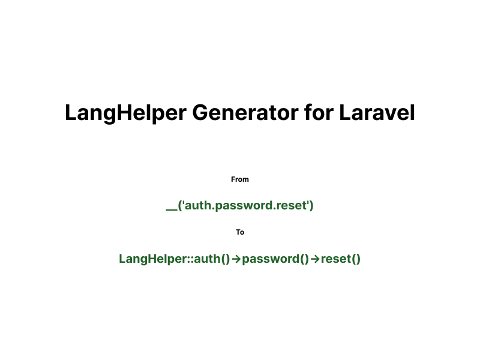

# LangHelper Generator for Laravel



---
[](https://packagist.org/packages/nycorp/lang-helper)
[](https://packagist.org/packages/nycorp/lang-helper)

Simple, structured and intuitive language helper generator for Laravel projects.

## ✨ Features

- 📁 **Group by folders**: Auto-organize translation keys into structured classes.
- 💡 **Intuitive access**: Access translations like `LangHelper::auth()->password()->reset()`.
- 🔄 **Nested keys support**: Full nested language file support.
- ❌ **No language selection required**: Automatically calls the default `__('auth.password.reset')` function.
- ✏️ **Detect unused lang file**: Easily find and clean unused translation entries.

---

## Installation

You can install the package via composer:

```bash
composer require --dev nycorp/lang-helper
```

---

## ⚙️ Usage

### 1. Generate LangHelper

```bash
php artisan lang:generate
```

This will create the `app/Helpers/LangHelper.php` and related group folders.

### 2. Detect Unused Translations

```bash
php artisan lang:generate --detect-unused
```

This will list all unused translation methods.

### 3. Example Usage

```php
LangHelper::auth()->password()->reset();
LangHelper::validation()->email();
LangHelper::validation()->email($value);
```

non existing file will generate
```php
LangHelper::navigation()->home();
// will return navigation.home
```

You can publish the config file with:

```bash
php artisan vendor:publish --tag="lang-helper-config"
```

This is the contents of the published config file:

```php
return [
    'excluded_directories' => [
        'vendor'
    ],
    'excluded_lang_files' => [
        // auth
    ],
];

```

---

## 📊 Potential Updates

- [ ] Fail safety like __()
- [ ] Verify usage on all key branch
- [ ] Auto-generate on file save (watch mode)
- [ ] Add support for parameter placeholders
- [ ] Blade components integration
- [ ] Make group namespaces configurable

---

## 🚀 Contributing

We welcome contributions! ✨

- Fork this repository
- Create a feature branch (`git checkout -b feature/my-feature`)
- Commit your changes
- Push your branch (`git push origin feature/my-feature`)
- Open a pull request!

We recommend clean, readable code and simple commit messages.

---

## 🙏 Thanks

This project was initially developed during a real-world [Shortext](https://shortext.ny-corp.io) need to simplify multilingual management in Laravel apps.

Enjoy! 🚀

## Changelog

Please see [CHANGELOG](CHANGELOG.md) for more information on what has changed recently.

## Contributing

Please see [CONTRIBUTING](CONTRIBUTING.md) for details.

## Security Vulnerabilities

Please review [our security policy](../../security/policy) on how to report security vulnerabilities.

## Credits

- [Yann Yvan](https://github.com/yann-yvan)
- [All Contributors](../../contributors)

## License

The MIT License (MIT). Please see [License File](LICENSE.md) for more information.


> Made with ❤️ for Laravel developers.

